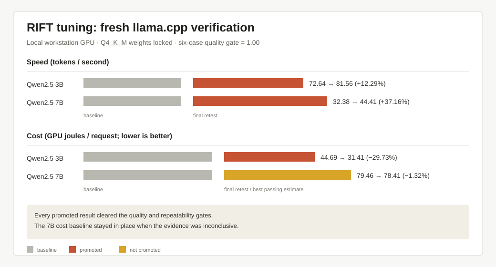

# RIFT

> **RIFT is an experimental, research project. Please forgive the mistakes.**
> APIs, adapters, deployment workflows, and platform support can change while
> the project is being validated.

RIFT is a hardware-aware control plane for local and small-cluster LLM serving.
It discovers machines, recommends an exact model artifact and backend, generates
an explainable deployment configuration, applies it with explicit permissions,
then benchmarks, tunes, monitors, and recovers the resulting service.

```text
discover -> model recommend -> plan -> apply -> operate
```

RIFT orchestrates established serving backends. It does not claim that every
model, format, backend, or PC is equally supported, and it labels measured,
published, estimated, and emulated evidence separately.

## What Works Today

- Measurement-aware CPU, RAM, GPU/VRAM, disk, pressure, thermal, and RIFT-owned
  service discovery.
- Bounded Hugging Face discovery with exact-artifact ranking, disk preflight,
  resumable pulls, hashes, provenance, and evidence confidence.
- Declarative `rift.yaml` generation, read-only plans, permission-gated apply,
  persisted state, governance policy, and diagnostic exports.
- A locally verified llama.cpp provider for GGUF models on the development
  workstation.
- Dynamically discovered backend adapters for llama.cpp, vLLM, SGLang, and
  MLX-LM; LMCache remains a separate optimization overlay. Linux/Apple adapter
  paths retain honest physical-platform acceptance gates.
- Exact artifact adapters for GGUF, dense/sharded SafeTensors, AWQ, GPTQ, FP8,
  EXL2, and MLX, with dependency and integrity checks that fail closed.
- Recommendation Contract V2 with format-neutral identity discovery, exact
  artifacts, separate trust dimensions, Pareto choices, persisted runs, and an
  optional measured finalist tournament. Published benchmark snapshots are
  signed and provenance-labelled; `rift model recommend` remains download-free by
  default and `--verify` is explicitly bounded and permission-gated.
- Reproducible benchmarks, bounded tuning, regression rejection, supervision,
  incidents, recovery, gateway limits, API keys, logs, and Prometheus output.
- Deterministic cluster placement and failure emulation. Physical multi-node
  acceptance remains a documented release gate.
- An optional mTLS node agent for desired-state reconciliation and node-side
  install/download/launch permission enforcement.
- A live technical dashboard backed by the RIFT control API.
- UI-first Elastic Intelligence Mesh onboarding: passive mDNS discovery,
  consent-gated private-subnet/USB/ADB bootstrap, explicit pairing, controller
  CA-issued mTLS identities, live topology evidence, policy-aware routing, and
  short-lived route leases. Physical heterogeneous-node acceptance is pending.
- Reproducible controller, node, gateway, and emulator container definitions.
  Mobile and native runtime experiments are preserved outside the release
  branch in the archival source tag.

See the [Project Status](#project-status) section for current support levels
and unresolved production gates.

## Fresh Clone

The intended first-run workflow requires only Python 3.10+ and network access
to install the declared Python dependencies. It does not install a model,
serving backend, GPU runtime, or compiler.

Windows:

```powershell
git clone https://github.com/aks-hayy/RIFT
cd rift
.\bootstrap.ps1
.\.venv\Scripts\rift.exe start
```

Linux/macOS:

```bash
git clone <rift-repository>
cd rift
./scripts/bootstrap.sh
./.venv/bin/rift start
```

The dashboard opens to onboarding. Use `--no-browser` on headless machines.

## Install From Source

The normal RIFT package is pure Python. CUDA, CMake, Ninja, Node.js, and a
native compiler are not required for the control plane. Serving backends remain
external, permission-gated adapters.

```powershell
python -m venv .venv
.\.venv\Scripts\Activate.ps1
python -m pip install --upgrade pip
python -m pip install .
```

Start the bundled dashboard:

```powershell
rift start --no-browser
```

Runtime state uses a platform-aware data directory and never belongs in the
checkout. Set `RIFT_HOME` to override it. Model weights, backend environments,
logs, certificates, caches, and reports are operator-owned runtime data and are
not included in the source distribution.

## First Deployment

```powershell
# Inspect hardware and installed providers.
rift discover

# Find the strongest practical model for this machine.
rift model recommend --task chat --top 5

# Ask what RIFT would recommend for a different workstation without touching this one.
rift model recommend --task chat --top 5 `
  --simulate-hardware "gpu=RTX 5090,vram_gb=32,ram_gb=64,disk_free_gb=500,os=linux"

# Optional: compare finalists by actually pulling/launching/benchmarking them.
# Every side effect remains explicit.
rift model recommend --task chat --verify --allow-download --allow-install --allow-launch
# Verify more finalists only when the extra download/launch cost is intentional.
rift model recommend --task chat --verify-top 3 --verify-budget 900 --allow-download --allow-install --allow-launch

# Let RIFT find the repo and exact artifact; this first command downloads nothing.
rift model pull --task chat --dry-run

# Remove --dry-run when the selection looks right.
rift model pull --task chat --output models/best

# Generate explainable intent and review every action. The command prints a
# recommendation run ID; use that ID to materialize a deployable config.
rift model recommend --task chat --write-report recommendations.json
rift plan --recommendation-run <recommendation-run-id>

# Plans are saved in the repository's plans/ directory.
rift plan list

# After reviewing the generated plan, apply its materialized config explicitly.
# Or run `rift apply` to choose from the saved plans interactively.
rift apply

# Non-interactive plan selection:
rift apply --plan 1 `
  --allow-download --allow-install --allow-launch

# Explicit YAML application still bypasses plan selection.
rift apply --config plans/recommendation-<recommendation-run-id>.yaml `
  --allow-download --allow-install --allow-launch

# For a hand-authored rift.yaml, use the same explicit permission gates:
# rift apply --config rift.yaml --allow-download --allow-install --allow-launch

# Operate the deployed service.
rift status
rift service benchmark --service chat --suite
rift service tune --service chat
rift stop --service chat --yes
```

### Choose A Model During Planning

`rift plan` can start from an existing recommendation download, one Hub
repository, one local model, or a directory of local models. It inspects and
shows the candidates before materializing a plan; it never downloads or
launches by itself.

Every generated deployment plan is written to `plans/` in the current
repository. RIFT also keeps a runtime copy for the control API. Older plans
created before repository-local plan storage remain visible as legacy runtime
plans until they are recreated.

```powershell
# Review pulled recommendation models and choose interactively.
rift plan

# Inspect one Hub repository or URL.
rift plan --huggingface Qwen/Qwen2.5-Coder-7B-Instruct-GGUF

# Inspect one local artifact.
rift plan --local-model D:\models\coder\model-Q4_K_M.gguf

# Rank a directory of local artifacts and choose one.
rift plan --models-dir D:\models

# Automation: select the displayed candidate without prompting.
rift plan --models-dir D:\models --select 2
```

Use `rift --json COMMAND ...` for automation. Human-readable tables are the
default. `--simulate-hardware` accepts a JSON object or a JSON file path as
well as comma-separated `key=value` pairs. Required simulation inputs are GPU,
VRAM, host RAM, and free disk; free VRAM/RAM default to total capacity unless
specified. Simulation is explicitly labelled and is read-only: it cannot pull,
install, launch, or verify a model.

### Give RIFT A Local Model

For a model already on disk, RIFT can manage the exact artifact without Hub
discovery:

```powershell
rift model inspect D:\models\my-model-Q4_K_M.gguf
rift model verify D:\models\my-model-Q4_K_M.gguf
rift model recommend --source local --models-dir D:\models --output rift.yaml
rift plan --config rift.yaml
rift apply --config rift.yaml --allow-launch
```

The equivalent explicit model section is:

```yaml
schema_version: 1
services:
  chat:
    model:
      source: local
      id: my-model
      local_path: "D:\\models\\my-model-Q4_K_M.gguf"
    policy:
      backend: llama.cpp
```

RIFT checks the exact file, backend compatibility, memory budgets, ports,
context length, and permissions before launch. It refuses incompatible model
and backend combinations instead of silently substituting a model.

### Choose A Hugging Face Repository Yourself

Automatic discovery is optional. For an exact repository, use its repository ID
such as `org/model` rather than the browser URL:

```powershell
rift model pull org/model --dry-run --max-download-gb 12
rift model pull org/model --output D:\models\org-model
rift model inspect D:\models\org-model
rift model verify D:\models\org-model --hash-mode all
rift model recommend --source local --models-dir D:\models\org-model --output rift.yaml
rift plan --config rift.yaml
rift apply --config rift.yaml --allow-launch
```

The dry run checks repository files, disk capacity, artifact size, revision,
and likely backend compatibility before any download. Private Hub-compatible
endpoints can be selected with `--endpoint` and `--token`.

### Node And Controller Enrollment

On the controller, start RIFT and open the dashboard's **Add Node** flow. The
controller opens a temporary enrollment window on port `11748`. On the new
device, run:

```powershell
rift node start --controller https://controller:11748
```

The node creates a persistent identity, displays a six-digit pairing code, and
waits for operator approval. The controller issues certificates and verifies
the node through an mTLS health check before marking it `ACTIVE`. The pairing
code is never shown in the controller UI. New nodes remain deny-by-default:

```powershell
rift node permissions show
rift node permissions set --inference allow
rift node permissions set --download allow --install allow --launch allow
```

Subsequent node starts reuse the identity and skip pairing. For Docker, the
controller must advertise its service hostname, for example
`RIFT_CONTROLLER_ADVERTISE_HOST=controller`, rather than advertising
`127.0.0.1`.

### Automatic Tuning

Normal `rift apply` uses hardware-aware backend defaults. Preview candidate
settings with:

```powershell
rift service tune --service chat
```

Run actual measured tuning with controlled restarts using:

```powershell
rift service tune --service chat --live --allow-restart
```

Live tuning measures a baseline and bounded backend candidates, waits for
health after each restart, selects the highest valid measured throughput, saves
the report, and restores the last known-good configuration if a candidate fails.
`rift apply --optimize` performs the same bounded measurement after the reviewed
service becomes healthy, using two candidates, one warmup, and three measured
repetitions per candidate. The baseline remains authoritative when tuning is
unavailable or a candidate fails.

For autonomous, profile-aware tuning of an already deployed `llama.cpp` service,
use the profiled command. It keeps the model artifact and weight quantization
locked. K/V cache precision can be explored only as a bounded, quality-gated
experiment; it is never changed silently. Context length and concurrency remain
fixed. Restarts are a reviewed maintenance action, so `--yes` and
`--allow-restart` are required:

```powershell
rift tune --service chat --profile speed --dry-run
rift tune --service chat --profile speed --allow-restart --yes
rift tune --service chat --profile cost --allow-restart --yes --no-apply
rift tune profiles
rift tune status
rift tune report RUN_ID --json
```

Speed maximizes measured generated tokens per second while rejecting latency regressions. Cost minimizes GPU joules per request
and requires usable GPU power telemetry; it is explicitly GPU-only in this
release. A run writes a durable journal under the RIFT runtime home and reports
the baseline, every candidate, reliability interval, winning configuration, and
the reason it contributed to the selected profile. Weight-quantization changes
remain recommendation-only. K/V precision can be included in the bounded search
when enabled, but it is quality-screened and only applied if the full promotion
gate passes. Backend startup,
HTTP, and quality-probe failures are isolated to the candidate and recorded as
rejections, so one bad flag cannot crash the tuning transaction.

#### RIFT automatic-tuning results (llama.cpp)

Automatic tuning is easiest to understand as a before-and-after experiment.
RIFT first runs the model with a deliberately ordinary, conservative
llama.cpp configuration. It then restarts the service between bounded
experiments, measures real requests, checks the output-quality suite, and
re-tests the winner before applying it. The model file and weight
quantization stay locked, so a speed-up cannot quietly trade away the model.

The fresh verification below used natural-language coding-assistant requests on
the local workstation GPU. Both models use the same `Q4_K_M` weights,
8,192-token context, one request stream, and n-gram speculation disabled. Speed
is generated tokens per second; cost is GPU joules per request (lower is
better). Every promoted result scored 1.00 on six deterministic quality cases.



| Model/profile | Baseline | Final or best passing measurement | Result |
| --- | ---: | ---: | --- |
| Qwen2.5 3B · Speed | 72.6386 tok/s | 81.5624 tok/s | **Promoted: +12.29%** |
| Qwen2.5 3B · Cost | 44.6906 GPU J/req | 31.4054 GPU J/req | **Promoted: −29.73%** |
| Qwen2.5 7B · Speed | 32.3785 tok/s | 44.4110 tok/s | **Promoted: +37.16%** |
| Qwen2.5 7B · Cost | 79.4569 GPU J/req | 78.4110 GPU J/req | Baseline retained |

The Cost profile is an energy experiment, not a one-flag switch. RIFT warms the
service, runs the same natural-language request repeatedly, integrates GPU
`power.draw` telemetry from `nvidia-smi`, and reports GPU joules per completed
request. It also records latency, failures, and process CPU time, so a cheaper
configuration cannot quietly become unusable.
The reading is aggregate device power, so a busy shared GPU can add noise; RIFT
keeps that limitation visible in the evidence.

The bounded llama.cpp search tested these parameter families:

- K/V cache precision: `f16`, `q8_0`, `q4_0`, `q4_1`, `iq4_nl`, selected mixed
  pairs, and precision-plus-batch combinations.
- Batching and CPU execution: batch sizes `128/256/512/1024/2048`,
  micro-batches capped at `128`, and thread/thread-batch values spanning one,
  half the physical cores, all physical cores, and logical processors.
- Attention and scheduling: Flash Attention `on/off/auto`, polling and
  batch-polling values, continuous batching, and parallel slots.
- Runtime controls: unified KV cache, KV offload, operation offload, repacking,
  host-memory use, load mode (`auto`, `mmap`, `mlock`, `mmap+mlock`), priority,
  CPU affinity, and platform-supported NUMA.

RIFT probes the installed llama-server first and includes a parameter family
only when that binary advertises the flag. Unsupported or startup-failing
variants are recorded and skipped, so the search stays grounded in the actual
backend and machine.

The model file, `Q4_K_M` weight quantization, context, concurrency, and GPU
layer placement were held constant. Every candidate had to start cleanly, pass
the six-case quality suite, avoid a material latency/CPU regression, and show a
positive 95% improvement interval. RIFT then re-tested the selected candidate
before promotion. That final gate is why the 7B cost baseline was retained when
its apparent 1.32% saving was not statistically conclusive.

The complete evidence, commands, hashes, confidence bounds, candidate
rejections, and raw runtime report IDs are in
[the re-verification record](docs/evidence/llama-cpp-profiled-tuning-reverification.md).
The JSON journals remain under `.rift-runtime/reports/` on the machine that ran
the experiment.

At present, llama.cpp is the only backend with RIFT's full, tailor-made
profiled tuning path (including real restarts, GPU-energy measurement, quality
gates, and rollback). vLLM and the other backends have baseline tuning hooks;
their deeper backend-specific implementations are next.

Use `--ngram-speculation` or `--no-ngram-speculation` to make the n-gram choice
explicit when tuning. It remains an opt-in scenario-specific acceleration, not
part of the general-purpose results above.

## Focused Commands

```text
Core workflow
  init, start, discover, plan, apply, status, dashboard, stop, doctor, tune

Model operations
  rift model recommend|pull|inspect|verify

Provider operations
  rift backend list|inspect|doctor|detect|install-plan|install|health

Service operations
  rift service benchmark|tune|logs|restart|rollback|gateway
  rift tune profiles|status|watch|report|cancel

Cluster operations
  rift cluster discover|plan|apply|status|drain|destroy

Node agent
  rift node start|status|stop|permissions

System and support
  rift system backup|restore|diagnostics|migrate
```

Run `rift COMMAND --help` for permission requirements and examples.

## Dashboard

```powershell
rift dashboard --port 8765 --control-port 8777
rift dashboard --detach
```

The canonical contributor UI source is `ui/`. Its production rich-console
bundle is published into `python/rift/web/static`, so users do not need an npm
install at runtime. When Node.js is available, `rift start` and `rift dashboard`
serve that bundled operator console; Node-less environments use the packaged
static fallback. Both paths work outside the source checkout.

The current console starts with discovery and trust onboarding, then provides
live mesh nodes, certificate/routability state, measured links, hardware,
services, models, benchmarks, incidents, logs, timeline, backends, and read-only
plans. Values derived from live state and preview-only future surfaces are
labeled in the UI. Mutating operations remain guarded by the same permissions
enforced by the CLI.

The UI must treat live controller API data as authoritative. It must label
measured, published, estimated, emulated, and unavailable values separately;
it must never render operational mock data as real state.

Adapter authors should use the versioned
[Adapter API V2 contract](docs/reference/rift-adapter-api-v2.openapi.yaml).

## Repository Layout

```text
ui/              canonical operator interface source
python/rift/web/  bundled dashboard assets
 docs/            machine-readable OpenAPI contracts only
deploy/          split OCI images and mesh Compose workflow
python/rift/     public Python and CLI facade
scripts/         contributor build helpers
tests/python/    control-plane and provider tests
```

The README is the canonical repository and operator guide. The OpenAPI files
under `docs/reference/` are retained as machine-readable contracts.

## Safety Model

RIFT never silently downloads a model, installs a backend, launches or stops a
service, executes remote commands, exposes a public port, or overwrites user
intent. Destructive operations require explicit confirmation, and public
network exposure remains an operator responsibility.

## Testing And Verification

Run the Python tests from an environment with the declared package
dependencies:

```powershell
python -m compileall -q python tests
Get-ChildItem tests\python -Filter '*_tests.py' | ForEach-Object {
  python $_.FullName
  if ($LASTEXITCODE -ne 0) { exit $LASTEXITCODE }
}
```

Container manifests under `deploy/containers/` and
`deploy/compose.mesh.yaml` can exercise controller/node enrollment, Docker
bridge-network discovery, mTLS activation, restart persistence, recovery, and
cleanup without modifying host model files. Tests distinguish real hardware
measurements, live backend measurements, deterministic emulation, and fake
provider contract tests. Emulation is not evidence of physical fleet
reliability.

## Compatibility And Project Status

RIFT is a pure-Python control plane suitable for local deployment workflows,
adapter-based backend management, and deterministic mesh/control-plane
emulation. Physical heterogeneous-node reliability remains
`UNVERIFIED_EXTERNAL`; this release does not claim to be a Kubernetes
replacement or to bundle serving backends.

Backend compatibility is the intersection of the exact artifact, architecture,
backend version, operating system, accelerator, memory budget, and workload.
llama.cpp with GGUF is the strongest locally verified path. vLLM, SGLang, and
MLX-LM have adapter contracts and platform-specific planning, but their broad
physical acceptance matrix is not yet complete. CPU-only fallback and remote
node plans are valid strategies when local acceleration is unavailable.

Known limits include incomplete physical heterogeneous-node evidence, limited
real-backend tuning coverage, no guarantee that every model family is
deployable, and no claim of Kubernetes-level production HA. These limits are
reported rather than hidden.

- [Controller OpenAPI](docs/reference/rift-controller.openapi.yaml)
- [Node Agent OpenAPI](docs/reference/rift-node-agent.openapi.yaml)
- [Adapter API V2 OpenAPI](docs/reference/rift-adapter-api-v2.openapi.yaml)
- [Contributing](CONTRIBUTING.md)
- [Security](SECURITY.md)
- [Changelog](CHANGELOG.md)

## License

Licensed under the [Apache License 2.0](LICENSE).
