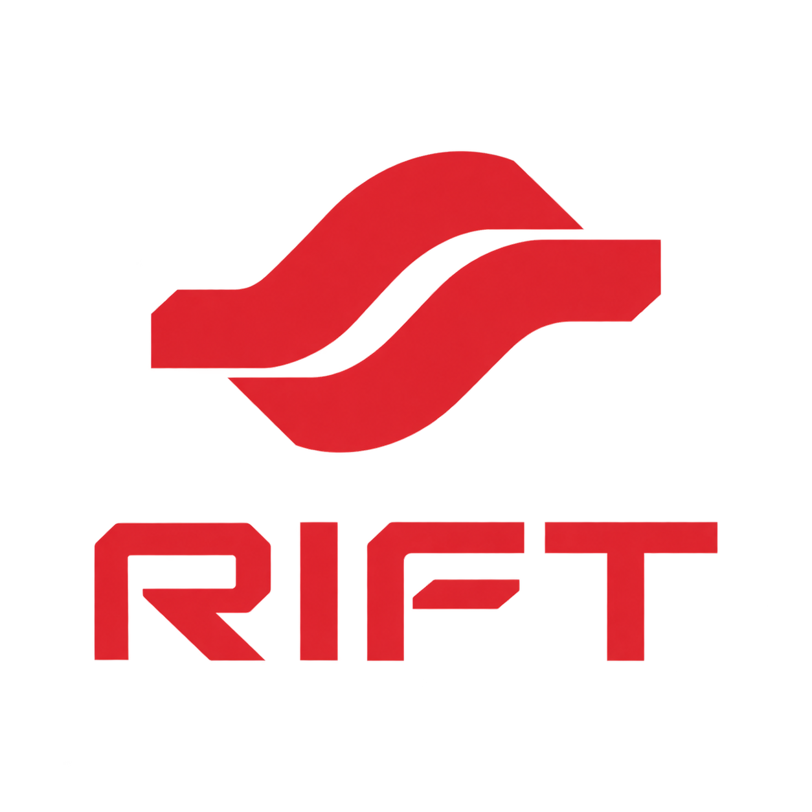
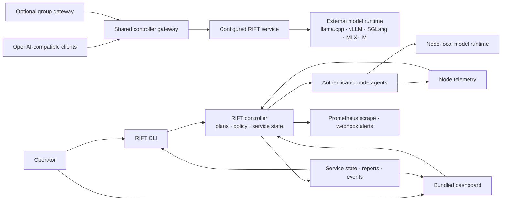

# RIFT

<p align="center">
  
</p>

### Local LLMs, with less guesswork.

RIFT is a hardware-aware control plane for choosing, deploying, and operating LLM services on a workstation or small cluster. Use the CLI, interactive shell, or bundled dashboard.

> **Not a stable release yet.** Expect bugs, rough edges, and changing behavior. Backend, model, operating-system, accelerator, and sensor support varies; check plans and permissions, and validate on your hardware.

## Features

### Hardware discovery and model recommendations

`rift discover` reports the machine's available resources and detected providers. `rift model recommend` ranks model artifacts against the task and hardware constraints, so you can inspect candidates before pulling or launching anything.

### Reviewable deployment plans

`rift plan` prepares an explainable deployment plan and `rift apply` carries it out. Downloading model files, installing a backend, and launching a service are separate actions protected by explicit permissions.

### Backend adapters and service operations

RIFT includes adapters for llama.cpp, vLLM, SGLang, and MLX-LM, and can manage service status, logs, restarts, and recovery. The serving runtimes are external; compatibility depends on the model artifact, operating system, hardware, and installed runtime.

### Gateways

The shared controller gateway exposes configured services through an OpenAI-compatible API. You can also start an optional dedicated listener for a service group.

### Benchmarking and tuning

RIFT runs repeatable service benchmarks and bounded tuning experiments. Tuning options depend on the backend; applying a candidate is guarded, and RIFT can reject candidates that fail configured quality or performance checks.

### Natural-language workload compiler

Describe a service in plain language or provide a JSON/YAML contract. RIFT turns supported requirements into a reviewable draft and shows questions or unsupported items instead of silently treating them as executable. Compilation does not grant permissions or deploy anything; review and approve a separate action envelope before a run. See the [workload compiler guide](docs/rift-user-guide.md#natural-language-workload-compiler).

### Telemetry and service objectives

Select telemetry profiles and configure service objectives, then inspect live readings, objective events, and completed reports. Objective transitions can be delivered through the configured webhook adapter, and the controller exposes a Prometheus-format scrape endpoint. A metric is shown as unavailable when its source cannot provide it.

Telemetry depends on what the operating system, drivers, and hardware expose. For example, CPU or GPU temperature may not be measurable on every system.

### Nodes and mesh

An optional node agent can enroll a machine with a controller. Nodes can be restricted to access-only use or permitted to share compute, with separate permissions for inference, downloads, installs, and launches. The controller can select eligible execution targets; the Nodes page shows enrolled nodes and measured network links.

### Ways to use RIFT

Use the CLI for scripted and interactive operations, including `rift shell`, or start the bundled local dashboard with `rift start`. The dashboard and CLI expose RIFT operations, with some workflows available only in one interface.

## Architecture at a glance


```mermaid
flowchart LR
  operator["Operator"] --> cli["RIFT CLI"]
  operator --> ui["Bundled dashboard"]
  cli --> controller["RIFT controller\nplans · policy · service state"]
  ui --> controller
  client["OpenAI-compatible clients"] --> gateway["Shared controller gateway"]
  gateway --> service["Configured RIFT service"]
  service --> runtime["External model runtime\nllama.cpp · vLLM · SGLang · MLX-LM"]
  controller --> agent["Authenticated node agents"]
  agent --> nodeRuntime["Node-local model runtime"]
  agent --> telemetry["Node telemetry"]
  telemetry --> controller
  controller --> records["Service state · reports · events"]
  records --> ui
  records --> cli
  controller --> integrations["Prometheus scrape · webhook alerts"]
  optional["Optional group gateway"] --> gateway
```

The [RIFT user guide](docs/rift-user-guide.md) explains the workflows, features, and command reference in detail.

## Quick start

Requires Python 3.10 or newer.

```powershell
git clone https://github.com/aks-hayy/RIFT.git
cd RIFT
.\bootstrap.ps1
.\.venv\Scripts\rift.exe start
```

On Linux or macOS, run `./scripts/bootstrap.sh`, then `./.venv/bin/rift start`. This starts the local controller and dashboard. Model and backend downloads or launches are separate, permission-gated actions.

After activating the created virtual environment, try:

```sh
rift discover
rift model recommend --task chat --top 5
rift shell
```

Use `rift --help` to explore commands. The dashboard opens locally; `rift start --no-browser` is available for headless use.

## License

Apache-2.0.
