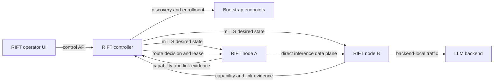

# RIFT Elastic Intelligence Mesh

Status: RIFT 1.2.0 preview  
Last updated: 2026-08-14

## Purpose

The RIFT Elastic Intelligence Mesh makes heterogeneous devices useful as one
managed AI environment without pretending that weak devices can be combined
into a single large accelerator. Each enrolled device can:

- execute an inference service locally when it has a compatible runtime and
  model;
- act as a secure client while a suitable nearby node executes the request;
- advertise measured capacity and runtime offers to the controller; or
- remain a managed endpoint without being eligible for inference routing.

The architecture is UI first. The operator begins with discovery and trust in
the RIFT dashboard, reviews every untrusted sighting, approves pairing, and only
then sees a node enter the trusted inventory. CLI and API surfaces expose the
same state machine for automation.

## Plane Separation



The controller owns desired state, trust, topology, placement, and route
decisions. It is not intended to proxy every token. The target data plane sends
inference traffic directly from a requesting node to the selected serving node
under a short-lived route lease. This keeps the controller out of the hot path
and allows a node to use an unexpired cached lease during a temporary controller
outage.

The controller-side route planner and persisted lease store are implemented and
covered by deterministic tests. A production node-to-node inference transport,
lease bearer validation at the serving node, and physical failover continuity
remain acceptance work.

## Discovery Is Not Trust

All discovery mechanisms emit the same transport-neutral `NodeSighting`
contract. A sighting contains a short-lived endpoint, node hint, API version,
interface identifier, and the SHA-256 fingerprint of the bootstrap TLS
certificate. Its initial state is always `DISCOVERED_UNTRUSTED`.

Supported discovery adapters are:

| Adapter | Behavior | Consent boundary |
| --- | --- | --- |
| Passive mDNS | Resolves `_rift-node._tcp.local.` advertisements. | Passive; enabled in the default controller. |
| Private subnet | Probes bounded HTTPS endpoints in private IP ranges only. | Explicit `authorized=true`; maximum host count is bounded. |
| USB network | Uses the same bounded private-network probe over a USB network interface. | Explicit authorization and configured network range. |
| ADB | Reads the RIFT bootstrap record from an already-authorized Android device. | Depends on the host/device ADB authorization prompt; enabled in the default controller. |
| Mass storage | Reads `.rift/rift-node.json` from configured removable roots. | The operator supplies the roots; the record remains untrusted. |

The HTTPS bootstrap probe binds the advertised identity to the observed TLS
certificate hash. Discovery records expire by TTL and are deduplicated by a
stable sighting ID. Discovery alone never creates a trusted node, authorizes a
remote action, or makes a device routable.

Only mDNS and ADB are registered by the default `MeshController` constructor.
The subnet, USB-network, and mass-storage adapters are implemented as injectable
providers and require an explicit controller configuration path before ordinary
UI users can invoke them.

## UI-First Enrollment

The onboarding flow is deliberately human gated:

1. The UI starts a discovery scan and displays untrusted sightings separately
   from trusted nodes.
2. The operator selects a sighting and inspects its endpoint and bootstrap
   fingerprint.
3. The controller creates a six-digit, time-limited pairing challenge. Only a
   scrypt hash and random salt are persisted.
4. The operator confirms the code shown through the node's trusted channel.
5. Successful pairing creates an `ENROLLED` node, but it remains non-routable
   with `CERTIFICATE_REQUIRED` mTLS status.
6. The node submits a signed CSR whose common name must equal its assigned node
   ID. The controller CA issues a client-authentication certificate.
7. Certificate activation moves the node to `ACTIVE`, records its certificate
   fingerprint, and makes it eligible for capability publication and routing.

The trust states are:

```text
DISCOVERED_UNTRUSTED -> PAIRING_PENDING -> ENROLLED -> ACTIVE
                                                   \-> REVOKED
```

Pairing challenges expire, comparison is constant-time, and invalid ordering is
rejected. Controller CA material is created with exclusive file creation. Node
certificates use ECDSA P-256, client-auth extended key usage, a `rift-node:` URI
identity, and a maximum validity of 365 days. The CA implementation requires
the optional `cryptography` dependency.

The explicit fingerprint activation API remains available for controlled
integration tests and externally provisioned certificate workflows. CSR
issuance is the intended managed path.

The current controller HTTP process is intended for loopback development and
does not authenticate operator or node calls. It must remain on loopback or
behind an authenticated TLS reverse proxy. Controller-side mTLS identity binding
is required before physical mesh acceptance.

## Node Capability And Topology Evidence

An active node record may publish a monotonically increasing capability
snapshot. The controller rejects stale or repeated sequence numbers. The target
transport binds that request to the node's mTLS identity; the current local
preview controller only enforces the ACTIVE state and node ID in application
state and does not yet terminate authenticated controller mTLS. A snapshot
carries:

- hardware inventory;
- current power, thermal, memory, and queue pressure;
- health state and queue depth; and
- zero or more runtime offers describing task, model, backend, context,
  expected first-token latency, decode rate, quality score, and locality policy.

Directional link measurements include median and p95 round-trip latency,
jitter, loss, upload/download throughput, observation time, and an evidence
label. Both endpoints must be active mTLS nodes before the controller accepts a
report. Newer observations replace older ones.

Sparse measurement is the default planning mode and bounds probes to a small
number of candidate peers per node. Intensive directional all-pairs measurement
exists but requires explicit consent. Every measurement and emulation result
retains an evidence label; synthetic values are never promoted to live facts.

## Routing And Route Leases

The route resolver takes an `InferenceIntent` with source node, task, minimum
context, minimum quality, privacy policy, service ID, and policy hash. It first
applies hard filters:

- node trust state must be `ACTIVE`;
- node health must be good;
- the link must be reachable;
- task, context, quality, and local-only offer requirements must match; and
- `LOCAL_ONLY` privacy forbids every remote candidate.

Feasible offers are scored using advertised first-token time, p95 link latency,
queue pressure, and quality. A large deterministic local bonus implements the
current local-first policy. The decision returns one selected candidate, up to
three fallbacks, rejected candidates with reasons, and the evidence class.

The controller persists a short-lived route lease containing the primary node,
fallback nodes, service, source, policy hash, and expiry. Lease TTL is bounded to
one hour; the API defaults to 30 seconds. A cached lease is rejected if it has
expired or if its policy hash no longer matches.

## Controller Recovery

Two recovery mechanisms are implemented as independent primitives:

- **Manual promotion:** an operator uses a recovery key of at least 16
  characters to promote a named node and persist the new controller identity.
- **Automatic election:** an optional odd voter set of at least three nodes
  elects a controller by majority for a positive term. Double voting in one
  term is rejected.

These primitives are deterministic unit-tested control logic. Replicated state,
network fencing, certificate-authority custody transfer, and physical controller
promotion are not yet integrated into the running controller service. Manual
promotion is therefore the default operational design; three-voter automatic
HA is an opt-in target, not a current production claim.

## Android Scope

The Android module is a UI-first node/client scaffold. It includes:

- passive controller mDNS discovery;
- fingerprint review and pairing-code approval;
- HTTPS-only controller and remote-inference clients;
- a private foreground telemetry service;
- Android Keystore AES-GCM storage for cached route leases;
- deterministic local-first route choice; and
- an explicit llama.cpp JNI boundary.

No fake inference path is supplied. Local inference reports unavailable unless
a real `librift_llama.so` and model are present. The APK has not been compiled or
run on a physical device in the current workstation environment, and managed
controller certificate rotation is not yet wired into the app.

## Container Roles

RIFT uses split OCI roles rather than one privileged image:

| Image | Responsibility |
| --- | --- |
| Controller | Operator and desired-state control plane. |
| Node | mTLS worker control endpoint. |
| Gateway | Policy-enforcing OpenAI-compatible request ingress. |
| Emulator | Deterministic fleet and routing laboratory. |

The supplied Compose profile runs as a non-root UID, uses read-only root
filesystems, drops Linux capabilities, enables `no-new-privileges`, persists
state in role-specific volumes, and mounts certificates at runtime instead of
baking secrets into images. A separate override requests NVIDIA worker access.

The manifests are statically verified. Docker is not installed on the current
workstation, so image builds, runtime startup, Linux CUDA compilation, and
container mTLS remain physical acceptance items.

## API Surfaces

Controller mesh APIs are rooted at `/api/rift/v2/mesh`:

- `GET /sightings`
- `POST /discover`
- `POST /enrollments`
- `POST /enrollments/{id}/approve`
- `POST /enrollments/{id}/certificate`
- `POST /enrollments/{id}/activate`
- `GET /nodes`
- `POST /nodes/{id}/capabilities`
- `POST /links`
- `GET /topology`
- `POST /routes/resolve`

The separate node-agent API remains rooted at `/v1` on port `11750` and requires
TLS 1.2 or newer with a controller client certificate. It exposes health,
hardware/backend discovery, artifact inventory, desired-state submission,
reconciliation, and state. The discovery bootstrap responder at
`/.well-known/rift-node` is a protocol contract consumed by discovery adapters;
it is not yet served by the current Python node-agent HTTP handler.

See [RIFT Controller OpenAPI](../reference/rift-controller.openapi.yaml) and
[RIFT Node Agent OpenAPI](../reference/rift-node-agent.openapi.yaml).

## Persistent State

The controller stores mesh state below `.rift/mesh/`:

```text
.rift/mesh/
  enrollment.json
  links.json
  route-leases.json
  pki/
    controller-ca.key.pem
    controller-ca.cert.pem
```

Writes use temporary-file replacement. Secrets and private keys must remain
outside source control and receive platform-appropriate filesystem protection.

## Verification Boundary

### VERIFIED

- Transport-neutral contracts, TTL expiry, discovery deduplication, and provider
  diagnostics are covered by Python tests.
- Explicit pairing, challenge expiry, wrong-code rejection, activation,
  capability sequence validation, link validation, routing, and lease expiry are
  covered by deterministic tests.
- CSR identity checks and controller CA issuance are covered where the
  `cryptography` dependency is available.
- Sparse versus explicitly authorized intensive topology measurement is tested.
- Local-first, privacy-constrained, overloaded-node, fallback, and no-route
  behavior is exercised by the deterministic mesh laboratory and labelled
  `EMULATED`.
- The controller HTTP route facade is tested with a persistent fake mesh
  controller.
- The UI compiles and its onboarding client is typed against the mesh API.
- Android security/manifests and container/Compose invariants have static tests.

### PHYSICAL_ACCEPTANCE_PENDING

- Real LAN mDNS across multiple operating systems and network segments.
- Consented private-subnet and USB-network probing against physical nodes.
- Mass-storage bootstrap and ADB enrollment on real devices.
- A built, installed, and exercised Android APK, JNI llama.cpp runtime, and
  Android client-certificate lifecycle.
- Docker/Compose image builds, startup, GPU passthrough, and container mTLS.
- Direct node-to-node inference traffic under a route lease.
- Link measurements and rerouting across heterogeneous physical nodes.
- Manual controller promotion with state/PKI transfer and three-voter election
  under real partitions.
- Multi-hour saturation, recovery, thermal, latency, and throughput acceptance.

RIFT must continue to label unit, emulated, static-build, and physical evidence
separately. None of the pending items can be promoted by adding more synthetic
tests alone.
