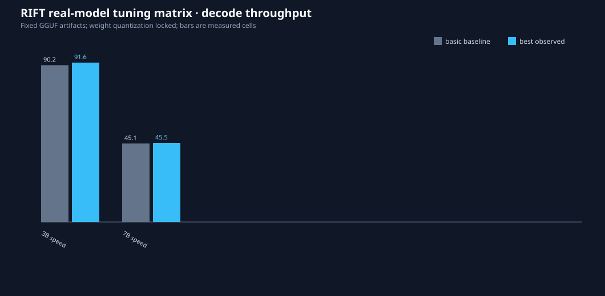
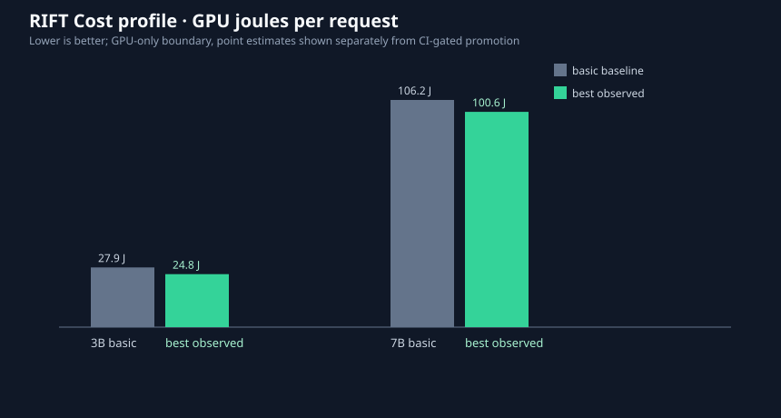
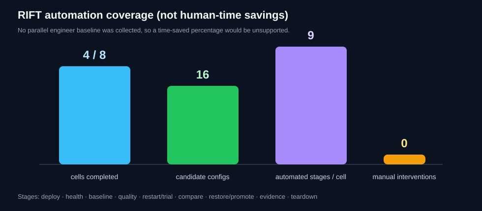

# Real-model tuning matrix — 2026-09-07

This run exercised Qwen2.5 Instruct 3B and 7B Q4_K_M artifacts on the local
RTX 4060 Laptop GPU. Each llama.cpp cell used a temporary RIFT service and was
torn down before the next cell. Weight quantization remained fixed.

## Results

| Model | Backend | Profile | Result | Baseline | Best observed | Quality | Teardown |
|---|---|---|---|---:|---:|---:|---|
| 3B | llama.cpp | Speed | `no_improvement` | 90.16 tok/s | 91.63 tok/s | 1.00 | verified |
| 3B | llama.cpp | Cost | `no_improvement` | 9.29 GPU J/req | 8.25 GPU J/req | 1.00 | verified |
| 7B | llama.cpp | Speed | `no_improvement` | 45.12 tok/s | 45.49 tok/s | 1.00 | verified |
| 7B | llama.cpp | Cost | `no_improvement` | 35.39 GPU J/req | 33.53 GPU J/req | 1.00 | verified |
| 3B | vLLM | Speed | `BLOCKED` | — | — | — | no service |
| 3B | vLLM | Cost | `BLOCKED` | — | — | — | no service |
| 7B | vLLM | Speed | `BLOCKED` | — | — | — | no service |
| 7B | vLLM | Cost | `BLOCKED` | — | — | — | no service |

The llama.cpp point estimates are shown separately from promotion decisions.
None survived the coordinator’s reliability gate in this short matrix, so no
candidate was promoted. A previously verified Flash-Attention promotion is
documented in the [promotion evidence](../real-tuning-validation/README.md#verified-promotion).

## vLLM installation finding

WSL Ubuntu and CUDA passthrough were present and `nvidia-smi` reported the RTX
4060 Laptop GPU. vLLM itself was absent. RIFT attempted an isolated
`vllm==0.28.0` installation after adding the required `python3.14-venv` package.
The vLLM wheel downloaded, but CUDA/PyTorch dependencies continued downloading
at roughly 50–100 KB/s for more than an hour. The incomplete environment was
removed; no vLLM service was launched or benchmarked. This is recorded as
`BLOCKED`, not as a performance failure.

## Automation metric

No human engineer performed a parallel baseline, so a time-saved percentage
would not be defensible. The measured automation proxy is 9 lifecycle stages
completed for each of 4 llama.cpp cells, 16 candidate configurations tested,
zero manual interventions during those cells, and verified teardown after each
service. The metric describes RIFT’s orchestration coverage, not human hours.

Full machine-local raw reports remain under
`.rift-runtime/reports/real-tuning-validation-20260907/`; they are intentionally
not committed because they contain local paths and process details. The
sanitized record is [`summary.json`](summary.json).
