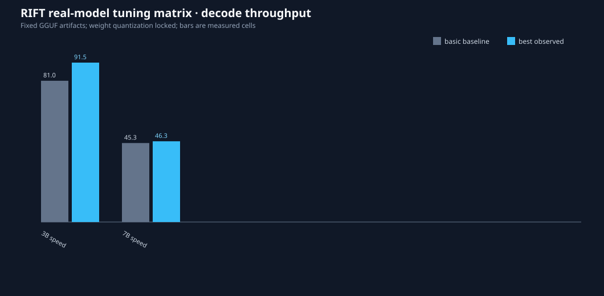
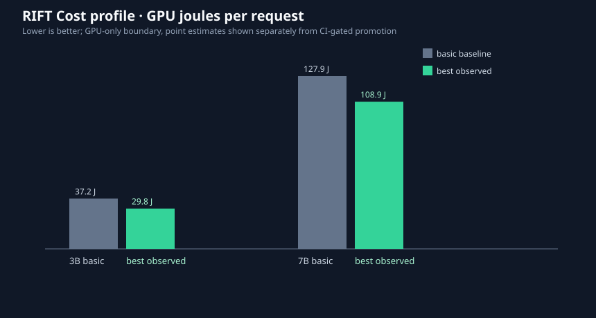
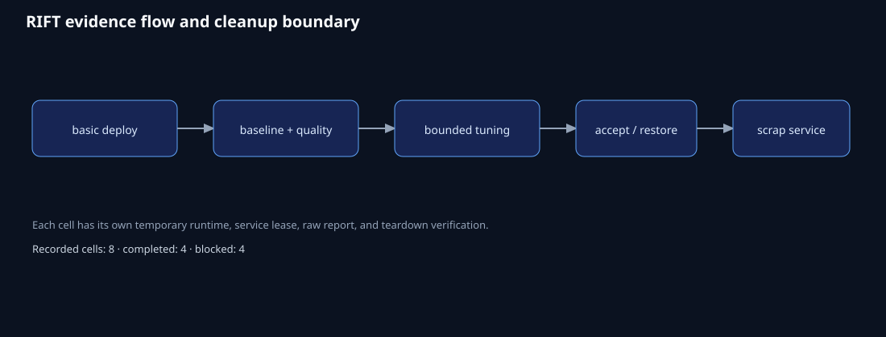
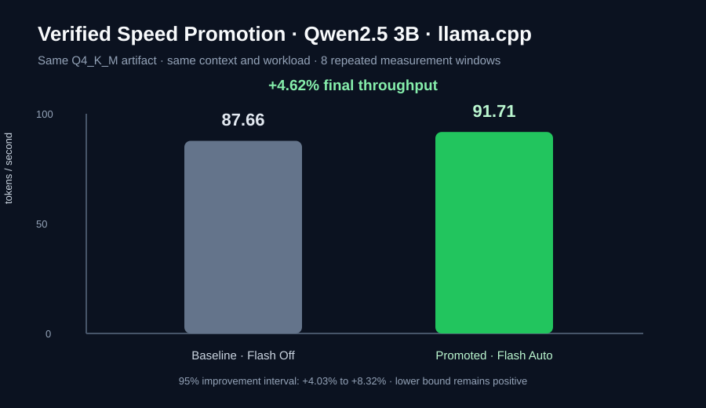

# Real-model tuning validation

Run date: 2026-09-06. Hardware scope: this workstation’s RTX 4060 Laptop GPU. The test artifacts were Qwen2.5 Instruct GGUF 3B (1.96 GB) and 7B (4.36 GB), both Q4_K_M. Weight quantization was locked during tuning.

## Results

| Model | Backend | Profile | Outcome | Basic baseline | Best observed | Candidates | Notes |
|---|---|---|---|---:|---:|---:|---|
| 3B | llama.cpp | Speed | `no_improvement` (CI-gated) | 81.05 tok/s | 91.45 tok/s | 4 | Point estimate improved; confidence interval crossed zero, so baseline was restored. |
| 3B | llama.cpp | Cost | `no_improvement` (CI-gated) | 37.20 GPU J | 29.83 GPU J | 4 | GPU energy boundary measured; no promotion without a defensible interval. |
| 7B | llama.cpp | Speed | `no_improvement` (CI-gated) | 45.29 tok/s | 46.31 tok/s | 4 | Point estimate improved; confidence interval crossed zero, so baseline was restored. |
| 7B | llama.cpp | Cost | `no_improvement` (CI-gated) | 127.90 GPU J | 108.91 GPU J | 4 | 14.85% point reduction; interval did not prove improvement, so baseline was restored. |
| 3B | vLLM | Speed / Cost | `BLOCKED` | — | — | — | vLLM, Docker, and accessible WSL runtime were unavailable. |
| 7B | vLLM | Speed / Cost | `BLOCKED` | — | — | — | vLLM, Docker, and accessible WSL runtime were unavailable. |

## Verified promotion

The focused promotion run used the same real Qwen2.5 3B Q4_K_M artifact and
kept model weights, quantization, context, batching, thread count, GPU-layer
placement, K/V precision, and sampling fixed. The deliberately conservative
baseline had `flash_attn=off`; RIFT tested the backend-supported alternatives,
then retested the winner before applying it.

| Measure | Baseline | Promoted winner | Evidence |
|---|---:|---:|---|
| Decode throughput | 87.66 tok/s | 91.71 tok/s | +4.62%; 95% interval +4.03% to +8.32% |
| Quality suite | 1.00 | 1.00 | `rift-tuning-core/v2`, passed with no regression |
| Changed setting | `flash_attn=off` | `flash_attn=auto` | one setting changed |
| Weight quantization | Q4_K_M | Q4_K_M | locked; no model replacement |

The final lower confidence bound stayed above zero, so the coordinator
promoted the winner through the normal apply path (`outcome=improved`,
`applied=true`). The temporary service was then torn down and teardown was
verified. Full sanitized details are in [`promotion.json`](promotion.json).

“Best observed” is deliberately separate from a promoted winner. RIFT only promotes a candidate when the profile objective improves with a positive confidence result and the quality gate passes. In these bounded runs, every llama.cpp quality suite passed at 1.00 and every service was restored and torn down; no unproven candidate was left running.

The four-candidate screen held model path, Q4_K_M weights, 4,096-token context,
one slot, GPU-layer placement, and sampling policy fixed. It tested the
llama.cpp K/V cache family (`f16` baseline, `q8_0`, and `q4_0` candidates),
alongside the configured batch/micro-batch and thread controls. The raw reports
also retain the exact launch arguments, artifact hashes, confidence intervals,
and candidate rejection reasons.

## What RIFT automated

Each completed matrix cell executed deployment, health checking, baseline measurement, six-case quality evaluation, restart/cleanup ownership, four-candidate comparison, restore, report generation, and service teardown. The focused promotion run added a 20-candidate screen and final retest. These are process-automation measures, not claims about human hours.

No human engineer baseline was measured, so no percentage “faster than manual tuning” is asserted. The raw, full-fidelity reports (including hashes, launch settings, measurements, rejection reasons, and teardown records) remain in the local runtime report directory:

`.rift-runtime/reports/real-tuning-validation-final/`

The raw reports contain local paths by design for reproducibility and are not copied into public evidence exports.

## Limitations

The quality suite is a bounded acceptance floor, not proof of universal model quality. Cost values are GPU-only energy measurements and must not be interpreted as whole-system joules. vLLM requires a qualified Linux, WSL2, or container runtime before its cells can be executed on this workstation.
