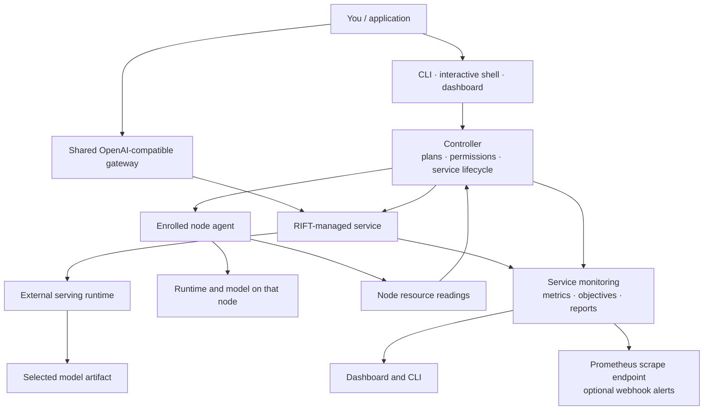

# RIFT User Guide

RIFT is a local-first control plane for choosing, deploying, and operating language-model services. This guide is for operators and users: it explains what the features do, how to use them, and what to expect without requiring you to know RIFT's internal implementation.

> **RIFT is not a stable release yet.** You may encounter bugs, incomplete screens, changing behavior, or backend-specific limitations. Start with a reviewed plan, grant only the permissions needed for the task, and validate results on the exact machine, model, and runtime you plan to use.

## Contents

- [RIFT in one picture](#rift-in-one-picture)
- [What RIFT is—and is not](#what-rift-isand-is-not)
- [Core terms](#core-terms)
- [Get started](#get-started)
- [Choose how you work](#choose-how-you-work)
- [Find models and serving backends](#find-models-and-serving-backends)
- [Plan and deploy a service](#plan-and-deploy-a-service)
- [Operate services and use the gateway](#operate-services-and-use-the-gateway)
- [Benchmark and tune](#benchmark-and-tune)
- [Monitor resources and service objectives](#monitor-resources-and-service-objectives)
- [Enroll and manage nodes](#enroll-and-manage-nodes)
- [Understand mesh routing and groups](#understand-mesh-routing-and-groups)
- [Natural-language workload compiler](#natural-language-workload-compiler)
- [Manage clusters](#manage-clusters)
- [System care, recovery, and diagnostics](#system-care-recovery-and-diagnostics)
- [Command reference](#command-reference)
- [Common questions and limits](#common-questions-and-limits)

## RIFT in one picture



Think of RIFT as the coordinator around a model service. It helps you decide what to run, previews the actions, applies only the actions you authorize, and keeps operational information together. The model files and serving programs remain separate from RIFT.

The usual lifecycle is:

1. **Discover:** check the hardware and what runtimes or model artifacts are already available.
2. **Choose:** ask RIFT to rank compatible model artifacts for the task and machine.
3. **Review:** inspect a deployment plan, including downloads, installs, launches, and estimated resource needs.
4. **Authorize and apply:** grant the required actions and start the service.
5. **Operate:** view health, logs, benchmarks, tuning runs, telemetry, objectives, and incidents.
6. **Stop or recover:** stop a service when it is no longer needed, or use the configured recovery path if it fails.

## What RIFT is—and is not

RIFT provides a common operator experience around supported LLM serving runtimes. It can help select a model/backend pairing, manage a service, provide a shared API gateway, benchmark or tune supported settings, and monitor the host and service.

RIFT is **not** itself a model, a model-weight download bundle, or a universal inference engine. It calls serving runtimes installed on the machine or managed through an explicit installation step. Model format, operating system, driver, accelerator, runtime version, and adapter support all affect what will work. RIFT's plan and capability checks are useful guidance, not a promise that every possible model/runtime/hardware combination is proven.

RIFT is also not a general-purpose workflow automation agent. Its workload feature creates and runs a bounded model-service workflow under an explicit approval envelope; it does not grant permission to execute arbitrary business actions or external tools.

## Core terms

| Term | Meaning in RIFT |
| --- | --- |
| **Controller** | The RIFT process that holds the local desired service state, prepares plans, applies permissions, and serves the dashboard/control API. |
| **Service** | A named, managed model-serving instance, with its selected model, backend, API address, and operating settings. |
| **Model artifact** | A concrete model file or repository revision/format. One repository can contain several different artifacts. |
| **Backend / runtime** | The serving program that loads the artifact and answers inference requests, such as llama.cpp or vLLM. It is external to RIFT. |
| **Plan** | A reviewable preview of intended actions and their prerequisites. Preparing a plan is not the same as applying it. |
| **Permission** | An explicit allowance for actions such as downloading a model, installing a backend, launching a service, or accessing a remote node. |
| **Gateway** | A shared OpenAI-compatible front door that forwards client requests to configured RIFT services. A group can have an optional dedicated listener. |
| **Node** | A machine running RIFT's optional authenticated node agent and enrolled with a controller. |
| **Mesh** | A controller's enrolled nodes, service definitions, groups, and request-routing capabilities. |
| **Telemetry profile** | A named selection of resource measurements to collect while a service is running. |
| **Objective** | A configurable rule that compares a selected metric with a threshold and records pass, warning, or breach transitions. |
| **Workload draft** | A structured, editable description of a requested service outcome, created from text or a JSON/YAML file. |

## Get started

RIFT requires Python 3.10 or newer. From a checkout:

```powershell
git clone https://github.com/aks-hayy/RIFT.git
cd RIFT
.\bootstrap.ps1
.\.venv\Scripts\rift.exe start
```

On Linux or macOS:

```sh
git clone https://github.com/aks-hayy/RIFT.git
cd RIFT
./scripts/bootstrap.sh
./.venv/bin/rift start
```

`rift start` starts the local controller and dashboard. The dashboard defaults to `http://127.0.0.1:8765`; the local control API defaults to port `8777`. `rift start --no-browser` starts without opening a browser, and `rift start --detach` runs in the background. Starting RIFT does **not** download a model, install a serving backend, or launch a model service by itself.

Start with these non-deploying checks:

```sh
rift --help
rift doctor
rift discover
rift model recommend --task chat --top 5
rift backend list
```

`rift init --config rift.yaml` creates a starter configuration. The default file describes a local `chat` service and its monitoring, gateway, and recovery settings. Review a generated config before using it; do not commit local paths, credentials, tokens, or private endpoints.

To stop a managed model service without deleting its model files, use `rift stop --service chat --yes`. For a foreground controller/dashboard, use the process's normal stop action (usually Ctrl+C); `rift stop` is specifically about RIFT-managed model services.

## Choose how you work

### Command line

The CLI is useful for repeatable tasks, scripts, detailed output, and commands that are not available in the dashboard. Use `rift --help` for the top-level list and `rift COMMAND --help` for options and safety requirements. Put the global `--json` option before the command when you need machine-readable output, for example `rift --json status`.

### Interactive shell

`rift shell` opens an interactive RIFT command environment. It is a convenience for exploring and repeating CLI operations; commands still follow the same permission and safety rules.

### Dashboard

Use `rift start` or `rift dashboard` to launch the bundled local dashboard. The main areas are:

- **Overview:** a high-level view of services, nodes, events, and operational state.
- **Services:** managed deployments and their detail pages. A service's available tabs include overview, playground, benchmarking, performance, monitoring, tuning, logs, configuration, and revisions.
- **Nodes:** enrolled-node health and a schematic map of enrolled nodes and measured network links.
- **Models:** model discovery and known local/service model information.
- **Groups:** service gateway groups and their optional listeners.
- **Operations:** incidents, rollouts, audit history, fleet logs, and metrics where the controller has data.
- **Tuning:** tuning runs and their status/results.
- **Settings:** controller settings, model sources, security, policies, and integrations.
- **Workload Deploy:** describe, review, approve, and run a workload draft.
- **Best Fit Setup:** a guided setup path for discovery, node enrollment, model selection, planning, and apply.

The dashboard is evolving along with the product. Some node-detail tabs (such as assignments, model cache, or diagnostics) may report that their data source is unavailable rather than show a complete management view. The node map is informational: it displays enrolled nodes and links for which RIFT has measurements; it is not a drag-and-drop route editor.

## Find models and serving backends

### Hardware-aware recommendations

`rift discover` summarizes local resources and available providers. `rift model recommend` ranks concrete artifacts against a task and the discovered or simulated hardware. The normal recommendation flow does not download weights. You can choose Hugging Face, a private source, or a local model directory with `--source huggingface|private|local`; `--models-dir` identifies the local directory.

Examples:

```sh
rift discover
rift model recommend --task chat --top 5
rift model recommend --task coding --formats gguf --top 5
rift model recommend --source local --models-dir ./models --task chat
```

The ranking is an estimate based on the available metadata and hardware information. A Hugging Face/private-source search may contact that source for metadata, but normal ranking does not download model weights. Check the exact artifact, quantization/format, source, size, license/access requirements, and plan before using it. A repository name alone does not identify which of its files is the right deployment artifact.

Some recommendation options can go beyond read-only ranking. In particular, pulling the best candidate or running verification can download artifacts, install a backend, or launch a temporary service when the relevant permission flags are provided. Treat `--verify`, `--pull-best`, and the `--allow-*` flags as action-bearing options; read the command's `--help` before using them.

### Pulling and inspecting artifacts

Use `rift model pull REPOSITORY --dry-run` to preview a specific-repository pull. Without `--dry-run`, the pull command is an intentional download operation. Check available disk space and source access first. `rift model inspect PATH` displays artifact information and compatibility observations; `rift model verify PATH` creates/checks an artifact manifest and can hash model data depending on the selected hash mode.

```sh
rift model pull organization/model-repository --dry-run
rift model inspect ./models/my-model
rift model verify ./models/my-model --hash-mode metadata
```

Use `--hash-mode model` or `all` only when the additional read time is acceptable for large artifacts. Verification is an integrity aid, not a model-quality guarantee.

### Backend adapters

The current adapter list includes **llama.cpp**, **vLLM**, **SGLang**, and **MLX-LM**. Detection and detailed capability vary by platform. Use:

```sh
rift backend list
rift backend detect
rift backend inspect llama.cpp
rift backend doctor llama.cpp
rift backend install-plan llama.cpp
```

The install plan is for review. Installing a runtime changes the machine and requires the explicit `--allow-install` flag, for example `rift backend install llama.cpp --allow-install`. Backend installation may require network access, build tools, drivers, containers, or platform-specific setup. RIFT does not bundle all serving runtimes by default.

## Plan and deploy a service

RIFT separates planning from applying. That lets you see intended downloads, installs, and launches before they happen.

### 1. Prepare a plan

For an automatically selected chat model:

```sh
rift plan --task chat
```

For a specific repository or an existing local artifact:

```sh
rift plan --huggingface organization/model-repository
rift plan --local-model ./models/my-model.gguf
rift plan --models-dir ./models
```

Plans can also set monitoring at creation time. For example, `--monitoring-profile cost` selects a named resource profile. `--monitoring-profile custom --monitoring-metrics process_cpu_percent,gpu_power_watts` selects explicit metrics. An objective policy can be attached with `--monitoring-policy path/to/objectives.yaml`.

Use `rift plan list` to review saved plans. A plan is a proposed set of actions and should be checked for the precise artifact, runtime, ports, expected resource use, and any network activity.

### 2. Apply only what you approve

Apply a selected plan by ID or number:

```sh
rift apply --plan 1 --allow-download --allow-install --allow-launch
```

The permission flags are separate on purpose:

- `--allow-download` permits fetching model artifacts.
- `--allow-install` permits installing a backend/runtime.
- `--allow-launch` permits starting the service.
- `--allow-remote` permits an action against a remote node or resource when that plan requires it.

Grant only what the reviewed plan needs. Without the required permission, RIFT reports a blocked action rather than silently performing it. `rift apply --config rift.yaml` applies the named configuration instead of selecting a saved plan. Avoid `--write-back` unless you want an optimized setting written into the source configuration.

### 3. Check the resulting service

```sh
rift status
rift status --service chat
rift service logs --service chat --tail 100
rift service monitor --service chat --iterations 1
```

The desired state (“what RIFT has been asked to run”) and observed state (“what RIFT can currently see”) are not always identical. A service may be starting, unhealthy, blocked, or unavailable. Check the plan, logs, backend diagnostics, and hardware before repeatedly retrying a failing launch.

## Operate services and use the gateway

### Service operations

RIFT can inspect service status and logs, run service benchmarks and tuning, read monitoring/objective history, list incidents, restart a service, and roll back to a known-good launch snapshot where one is available. Recovery is bounded by the configured service policy; `rift service monitor` is observational by default. Add `--allow-recovery` only when you want the monitor command to attempt its reconciliation/recovery behavior.

```sh
rift service monitor --service chat --iterations 0
rift service incidents --limit 20
rift service restart --service chat --allow-launch
rift service rollback --service chat --allow-launch
```

`--iterations 0` keeps the CLI monitor running until interrupted. Restart/rollback can start a process and so require launch permission. A rollback uses the last known-good launch snapshot when possible; it is not a promise that model files or external runtime versions can be restored automatically.

### Shared OpenAI-compatible gateway

The controller can run one shared gateway for configured services. It provides standard OpenAI-shaped API paths for supported operations and records request/error/latency data for traffic that passes through it. The gateway does not make an unavailable service healthy; check `rift gateway status` for its listeners and routes.

```sh
rift gateway start --config rift.yaml
rift gateway status
rift gateway stop
```

With the starter configuration, the gateway commonly binds to `127.0.0.1:11734`. A basic chat request is:

```sh
curl http://127.0.0.1:11734/v1/chat/completions \
  -H "Content-Type: application/json" \
  -d '{"model":"YOUR_MODEL_ID","messages":[{"role":"user","content":"Hello"}],"stream":false}'
```

Replace `YOUR_MODEL_ID` with the model identifier accepted by your configured backend. Use the actual host, port, and service configuration shown by `rift gateway status` or your config. Before binding beyond loopback, configure appropriate gateway API-key protection and trusted CORS origins in the local settings/configuration, then verify the result. Do not expose an unprotected development gateway directly to an untrusted network.

### Optional group gateway

Groups give a related set of registered services a stable path and, if desired, a separate listener. A group listener is optional; the main controller gateway remains the shared default.

```sh
rift mesh service register --id assistant --model organization/model --revision main --task chat
rift mesh groups register --id team-a --service assistant --default-service assistant --gateway-path /team-a
rift gateway group start team-a --port 11736
rift gateway group status team-a
```

Register the actual model ID and revision that match the service catalog/configuration. The group path is served by the main gateway when configured; the separate `rift gateway group start` listener is an additional entry point. Stop it with `rift gateway group stop team-a`. The group listener is not a separate model runtime.

## Benchmark and tune

### Benchmarking

Benchmarks let you compare a service under declared tests rather than rely on a single generation. A short smoke profile checks basic operation. Other profiles focus on interactive use, throughput, context behavior, reliability, output checks, or reproducible research studies. Run cost and time can grow with request limits, concurrency, repetitions, and quality-case count.

```sh
rift service benchmark --service chat
rift benchmark --service chat --profiles smoke,interactive,throughput
rift benchmark list --service chat
rift benchmark show RUN_ID
rift benchmark compare RUN_ID_A RUN_ID_B
rift benchmark export RUN_ID --format html
```

For controlled studies, `rift benchmark plan --spec study.yaml` previews a spec before you accept the run with `--yes`. Research study types include repeatability, paired comparison, factorial comparison, context-position, prefix-reuse, and custom cases. RIFT can also register an external OpenAI-compatible endpoint as a benchmark target; take care not to store API credentials in a committed file.

Benchmarks describe the tested inputs and conditions. They are not a universal speed promise, an exhaustive safety/quality certification, or a substitute for your production workload. Compare runs on the same machine with comparable model, prompt, context, concurrency, warm-up, and runtime settings.

### Tuning

Tuning runs bounded candidate searches to improve a stated objective while checking selected performance/quality guardrails. The global `rift tune` command supports **speed** and **cost** profiles. Backend-specific controls differ; unsupported or unmeasurable controls are not magically optimized.

Start with a preview:

```sh
rift tune --service chat --profile speed --dry-run
rift tune --service chat --profile cost --dry-run
```

An actual run can use a time budget and a reviewed maintenance window:

```sh
rift tune --service chat --profile speed --budget 30m --allow-restart --yes
```

Tuning may restart a service to test candidates. Use `--no-apply` to run/validate without promoting the winning candidate automatically. For persistent runs, inspect `rift tune status RUN_ID`, `rift tune watch RUN_ID`, and `rift tune report RUN_ID`. Available lifecycle actions also include cancel, apply, rollback, profiles, and opportunities; see `rift tune --help` before using those state-changing actions. `rift service tune` runs a bounded backend search for an individual managed service.

An improvement is valid only for the measured hardware, model, backend, workload, and objective. If the run reports no feasible candidates or unavailable GPU-energy data, treat that as a measurement/support limitation rather than a successful optimization.

## Monitor resources and service objectives

### What is collected

RIFT starts resource monitoring for managed services by default, with a balanced `default` profile and a 2-second sample interval in the starter configuration. A profile filters what is recorded; the collector can know about more values than the service selected.

| Profile | Collected metrics |
| --- | --- |
| `minimal` | Service-process CPU and memory, GPU utilization, GPU VRAM pressure. |
| `default` | Host CPU, service-process CPU and memory, host RAM pressure, GPU utilization, GPU VRAM pressure, GPU power. |
| `performance` | All catalogued metrics, including optional temperatures, VRAM used, and gateway request metrics. |
| `cost` | Service-process CPU and memory, host RAM pressure, GPU VRAM used/pressure, GPU power. |
| `custom` | The metric IDs explicitly selected by the user. |

The selectable catalog currently includes host CPU utilization, service-process CPU and resident memory, host RAM pressure, CPU temperature, GPU utilization/temperature/VRAM used/VRAM pressure/power, gateway request error ratio, gateway service availability ratio, average request latency, and last request latency.

Sensor values are best-effort and must be read with their availability/source information:

- **CPU temperature** depends on the host's exposed sensor API. It may be unavailable even when CPU usage and RAM readings work.
- **GPU temperature, utilization, VRAM, and power** are currently queried through `nvidia-smi`; this source is NVIDIA-specific and can fail if the utility, driver, permission, or device does not provide a field.
- Some GPU measurements are device/node aggregates. GPU power and energy are not exclusive to one service when multiple processes share a GPU. Service CPU and process memory are closer to process-level measurements.
- A number shown as unavailable is not zero. Do not use unavailable telemetry to claim a threshold passed.

RIFT can save live samples, sessions, sustained resource signals, objective transitions, and a completed report when service monitoring ends. Reports summarize the recorded interval (including average, minimum, maximum/peak and derived energy/cost where the source and accounting inputs permit). Cost estimates depend on configured electricity price or compute cost; they are estimates, not a utility bill or a per-process hardware energy meter.

Read telemetry from the CLI:

```sh
rift service telemetry --service chat --latest
rift service telemetry --service chat --signals
rift service telemetry --service chat --report
rift service objectives --service chat
rift service objectives --service chat --events
rift service objectives --service chat --report
```

The service's Monitoring tab shows live charts/values and past reports when available. Telemetry is also accessible through controller APIs. The controller exposes a Prometheus-format scrape endpoint at `/api/rift/metrics/prometheus` on the control API port (default `8777`), which you can configure a local Prometheus server to scrape. Alert delivery has a built-in webhook adapter; email delivery is not built in. Webhook delivery failures do not stop model requests, and the objective transition remains in RIFT's stored history.

### Configure metrics and custom thresholds

In YAML, telemetry profile/resources belong to a service's `monitoring.resources`; objectives belong to `monitoring.objectives`. A service objective can use any catalogued metric, an operator (`<=`, `>=`, `<`, `>`, `==`), a threshold, an aggregation, and an optional time window. Optional warning, recovery, consecutive-breach, and alert-adapter settings help avoid reacting to a single noisy sample.

Example objective policy:

```yaml
services:
  chat:
    monitoring:
      resources:
        enabled: true
        profile: default
        sample_interval_seconds: 2
      objectives:
        - id: request-errors
          metric: request.error_ratio
          operator: "<="
          threshold: 0.01
          warning_threshold: 0.005
          aggregation: average
          window_seconds: 300
          consecutive_breaches: 3
          recovery_consecutive: 2
          alerts: [webhook]
```

To use a custom metric subset, set `profile: custom` and give `metrics` as a list of catalog IDs. For example: `metrics: [process_cpu_percent, gpu_power_watts, gpu_temperature_c]`. An objective's required known metric is added to the collection selection automatically.

Webhook adapter configuration is global under `observability.telemetry.alerts`:

```yaml
observability:
  telemetry:
    alerts:
      webhook:
        endpoint: https://your-private-alert-receiver.example/events
        timeout_seconds: 5
```

Keep private receiver URLs and credentials out of shared source control. Alert settings choose where configured transitions are sent; they do not add a new metric source.

### Availability and uptime objectives

`service.availability_ratio` is a ratio of successful gateway requests to all gateway requests. It can be used with an adjustable objective such as `operator: ">="` and `threshold: 0.999` for a 99.9% request-success target. `request.error_ratio` is the corresponding failed/completed gateway-request ratio. These values require requests to pass through the RIFT gateway. They are not an independent synthetic uptime probe: with no gateway traffic the value can be unknown, and they do not prove the service could have answered a request during every idle moment.

Other objectives can target resource ceilings/floors such as GPU temperature, RAM pressure, GPU power, request latency, or error ratio. RIFT evaluates the metric you configure; choose the aggregation and window to match the operational question. Time-to-first-token is not in the current selectable telemetry catalog. Do not label a generic latency measurement as TTFT unless a future collector explicitly provides it.

## Enroll and manage nodes

RIFT's optional node agent lets one controller coordinate other machines. Enrollment has two separate steps: prove the node identity with a short pairing code, then activate the trusted connection. Merely seeing a node on the network does not enroll or trust it.

### Controller-side flow

In the dashboard's **Best Fit Setup** flow (or enrollment controls in Settings), open the temporary enrollment window. In a terminal on the candidate machine, run:

```sh
rift node start --name inference-worker
```

When the controller is not discoverable on the local network, provide its enrollment URL:

```sh
rift node start --controller https://CONTROLLER_HOST:11748 --name inference-worker
```

The node command advertises and looks for a controller using local discovery when `--controller` is omitted. For a routed or segmented network, ensure the controller can reach the advertised node address; `--host`, `--advertise`, and `--port` are available for network setups that need explicit values. Default node-agent port is `11750`. Do not publish these ports to an untrusted network without appropriate network controls.

The candidate appears as an untrusted request. Confirm that its name and address are expected, then enter the six-digit code shown in the node's terminal. The controller does not reveal the expected code. After pairing approval, the certificate/activation step must complete before the node becomes active and routable. Keep the node command running, or deliberately use the optional `--install-service` flag if you want an auto-start service installed on that machine.

### Permissions and participation

Enrollment does not automatically grant a node permission to download models, install software, launch services, or accept inference. This is a deliberate safety boundary. The local CLI exposes effective permission inspection and edits:

```sh
rift node status
rift node permissions show
rift node permissions set --participation access-only --inference deny --download deny --install deny --launch deny
```

`access-only` means the node can be an enrolled/viewpoint member but does not share compute. `share-compute` allows it to be considered as a provider; grant individual capabilities separately, for example `--inference allow`. Download, install, and launch permissions remain separate controls. Start from the least privilege needed and review the effective result with `rift node permissions show`.

The current UI supports discovery, opening an enrollment window, pairing approval, and viewing enrollment/node state. Detailed node permission editing is available through the CLI; the node detail page is not yet a complete permissions console.

To stop the agent, use `rift node stop`. `rift node status` reports local agent health and desired state. The controller's Nodes area shows enrollment, activation, health, queue state, and measured link information when reported.

## Understand mesh routing and groups

### Controller-selected request targets

The mesh router considers whether nodes are active and healthy, whether compute sharing is allowed, whether the requested model/task/capability fits, privacy restrictions, measured reachability/link quality, and reported queue state. It can prefer suitable local execution to avoid a network hop and consider eligible remote nodes when local execution is not suitable. These are routing inputs, not an SLA promise; the result depends on current node reports and available model/service offers.

### What the topology map does today

The Nodes page shows enrolled node identities and **measured** network links. It does not draw guessed links when measurements are absent. The current map is schematic and informational: it does not implement drag-and-drop directional route creation or a manual node-to-node route editor. The CLI can register mesh services and groups and manage mesh deployments, but does not currently expose a command to draw/configure arbitrary directed links. The route-selection capability exists separately from that planned operator editing experience.

### Mesh services and groups

The CLI can register a model-backed service with an explicit model/revision, place services in a gateway group, and manage deployment revisions/replica targets:

```sh
rift mesh service register --id summarizer --model organization/model --revision main --task chat --replicas 1
rift mesh service list
rift mesh groups register --id document-tools --service summarizer --default-service summarizer --gateway-path /documents
rift mesh groups list
rift mesh deployment deploy --service summarizer --revision main --replicas 1
rift mesh deployment list
```

Other deployment actions include `terminate`, `rollback`, `scale`, and `reconcile`. Reconciliation can place desired replicas onto healthy shared-compute nodes when their capabilities and permissions permit. Verify actual active/routable status after any change.

## Natural-language workload compiler

The **Workload Deploy** screen and `rift workload` commands turn a short service request into a reviewable workload draft, then—only after a separate approval—can carry it through model selection, deployment, and acceptance checks. The compiler is deterministic and local to the RIFT controller; it is not another LLM interpreting arbitrary instructions. It recognizes a limited vocabulary and set of common ways to express requirements. Anything it cannot safely understand should be clarified or entered in the structured contract.

### What the compiler can understand

The compiler extracts supported fields and keeps the evidence for how it interpreted them. Exact values in structured JSON/YAML take precedence over text inference.

| Requirement | Examples the current compiler understands | What appears in the draft |
| --- | --- | --- |
| Task | “coding assistant”, “RAG/retrieval”, “invoice extraction”, “chat” | `coding`, `rag`, `documents`, or `chat`. Unrecognized wording falls back to chat, so check this field. |
| Optimization preference | “fast”, “throughput”, “tokens per second”, “low cost”, “energy efficient” | `speed`, `cost`, or `balanced`. Balanced is a default, not an inferred user preference. |
| Decode speed | “at least 30 tokens per second” or a structured minimum | A minimum decode rate and a `per_request` or `aggregate` scope. If multiple users make the scope ambiguous, the draft can ask you to clarify. |
| First-token latency | “under 2 seconds to first token” or a structured millisecond value | Maximum TTFT in milliseconds. The current contract uses p95; a threshold without an explicit percentile can produce a review question. |
| Capacity and load | “8K context”, “2 concurrent users”, “5 requests per second” | Context capacity, concurrency, and request rate when recognizable. Context defaults to 2,048 tokens and concurrency to one when omitted. |
| Capabilities | “tool calling required”, “strict JSON output” | A capability requirement. Tool calling means checking whether the deployed model can emit a core tool-call shape; it does not run your tools. |
| Network/backend preference | “offline”, “no internet”, “llama.cpp”, “vLLM”, or a model family | Offline versus approved model sources, plus supported backend/model-family preferences. If not specified, the contract's network policy defaults to approved sources; the execution envelope can still restrict the run to offline. |
| Reliability objective | A phrase such as “99.9% uptime” | An availability-ratio objective with a default 30-day observation window in its draft metadata. Review its source and window; it is not a synthetic uptime probe. |

Natural-language inference is deliberately narrow. For exact service names, thresholds, task IDs, and policy choices, use structured input. The compiler records defaults and inferred values in provenance; the `show` command returns that provenance with the contract. The UI shows the compiled contract and surfaces review questions, warnings, and unsupported requirements.

### Compile and review a draft

For example, this request explicitly names task, throughput scope, TTFT, context, concurrency, and network policy:

```sh
rift workload compile --text "coding assistant, at least 30 tokens per second per request, under 2 seconds to first token p95, 8K context, 2 concurrent users, offline" --confirm-default-quality
```

The command saves a draft by default and prints its ID, revision, contract hash, interpreted input, warnings, and unsupported requirements. Use the returned ID to inspect it:

```sh
rift workload show DRAFT_ID
```

If you omit `--confirm-default-quality` and do not provide a versioned quality suite, the compiler asks you to choose or confirm one; drafts with unresolved review questions cannot be approved. The shortcut records `rift-text-core/v1`, a 0.90 floor, and a required `response_nonempty` case. That built-in case is intentionally basic: it checks for a non-empty response, not whether a coding answer is correct or whether the model is suitable for your domain. The recorded score floor should not be mistaken for a general model-quality grade; the current easy path runs the declared cases and reports their pass/fail evidence.

To print a draft without saving it, add `--no-save`. To compile a structured contract from a UTF-8 JSON or YAML file, use `--file`:

```sh
rift workload compile --file workload.yaml
```

The UI offers Natural language and Structured JSON input modes. Edit the request and compile again if the result is wrong; the current command flow does not provide a free-form editor for every compiled contract field. A corrected compile creates a new draft/hash, so do not reuse an approval for a changed request.

Example structured contract for the same coding-service intent:

```yaml
schema_version: 1
task: coding
objective: speed
performance:
  min_decode_tps: 30
  decode_scope: per_request
  max_ttft_ms: 2000
  ttft_percentile: 95
  context_tokens: 8192
  concurrency: 2
  request_rate: null
quality:
  suite_id: rift-text-core
  suite_version: v1
  minimum_score: 0.9
  required_cases: [response_nonempty]
capabilities:
  tool_calling: false
  structured_output: false
policies:
  network: offline
  backend: null
  model_family: null
service:
  name: coding-assistant
```

The compiler preserves recognized unsupported requirements in the draft rather than silently executing them. Examples include prompt-caching or FlashAttention requests and several raw runtime flags. The draft may have warnings or explicit questions; resolve them, use supported structured fields where possible, and do not assume that a visible requirement is already enforced. Text such as “grant permission”, “run a shell command”, or “delete files” never grants RIFT permission to do those things.

### Strict JSON and output schemas

If the request requires strict JSON/schema-conforming output, attach the exact schema during compilation. For the CLI, provide a local JSON Schema file:

```sh
rift workload compile --text "invoice extraction with strict JSON output" --output-schema invoice.schema.json --confirm-default-quality
```

In the UI, upload a JSON schema file before compiling. RIFT validates and hashes the schema, displays the hash in the draft, and—where the selected backend supports the structured-output path—configures the gateway to enforce and validate responses against it. JSON-only wording without a schema creates a review question. RIFT supports a portable subset of JSON Schema; unsupported schema assertions are rejected rather than ignored. Strict structured-output acceptance needs both an attached schema and an executable evaluator.

### Approval: permissions are a separate decision

Compilation itself does not download models, install a backend, launch a service, restart a process, promote a tuning result, or grant network access. Approval freezes the reviewed draft revision/hash together with a bounded action envelope. Available controls include network/source and license limits, time and candidate/download budgets, and separate permissions for download, install, temporary launch, restart, promotion, cleanup, and remote execution. The current easy-path runner targets the local machine; enabling a remote permission does not make remote workload execution available.

For an offline run using a local models directory:

```sh
rift workload approve DRAFT_ID --network offline --allow-launch
```

Without `--yes`, the CLI prints the proposed envelope for review and makes no approval. After reviewing it, confirm the same envelope:

```sh
rift workload approve DRAFT_ID --network offline --allow-launch --yes
rift workload run --approval-id APPROVAL_ID --models-dir ./models
```

The returned approval ID is printed by the confirmed approval command. Offline mode sets download budgets to zero and requires an explicit local models directory at run time. If no compatible local model passes preflight, the run is blocked or marked infeasible rather than silently switching to a download.

For a Hub search, approve only the source/actions/budget you intend to permit, then name an exact repository if appropriate:

```sh
rift workload approve DRAFT_ID --network approved_sources --allow-download --allow-install --allow-launch --total-download-gib 8
rift workload approve DRAFT_ID --network approved_sources --allow-download --allow-install --allow-launch --total-download-gib 8 --yes
rift workload run --approval-id APPROVAL_ID --model-ref organization/model-repository
```

The first approval command displays the envelope; the second confirms it. The CLI's default source/license policy is Hugging Face and Apache-2.0. Review those constraints and the download budget before confirming. `--allow-install` is only needed if the selected runtime is not already available. `--no-tune` on the run command disables the optional speed/cost tuning step.

The UI follows the same boundary: compile first, review the interpreted contract/questions, then choose offline or approved sources, license filter, time/candidate/download limits, and action checkboxes. Only the explicit **Approve & start deployment** action begins the run. In offline mode, provide a local model directory; in approved-sources mode, local compatible artifacts are searched first, while downloads/installations still require their own checked permissions.

Keep the workload's network requirement and the approval envelope consistent. If the request says `offline`, that contract requirement cannot be relaxed by approval. If the request does not mention a network restriction, the compiled contract defaults to `approved_sources`; the envelope's `--network offline` setting limits authorized actions but does not rewrite that contract. For a strict no-network request, include “offline” or “no internet” in the workload itself and approve it offline.

### What a run does—and what “verified” means

After approval, the run checks the envelope, target, network policy, budgets, and model candidates; creates and applies a reviewed deployment plan; waits for endpoint readiness; and performs fresh health, benchmark, and registered quality checks. It can also run the core tool-call capability check when requested. A speed/cost tuning attempt may be invoked when the minimum decode-rate requirement is missed and the approved envelope allows restarts. Run progress and final outcomes are journaled; the UI shows stages and prior runs.

The current v1 runner's most important hard checks are readiness, usable benchmark results, required evaluator cases, the context capacity in the deployment plan, requested core tool-call capability, strict output-schema acceptance when configured, and minimum decode throughput. Not every parsed field is a hard acceptance gate today: in particular, do not treat a drafted TTFT or request-rate value as passed unless the run result explicitly contains that check. A `VERIFIED` result means this bounded run passed its implemented checks for that exact service and test; it does not prove arbitrary prompt quality, long-term uptime, or production suitability.

If the compiler recognizes “99.9% uptime”, it drafts `service.availability_ratio >= 0.999` and currently includes a default 30-day observation window. The monitor derives availability from successful versus total RIFT-gateway requests. It is therefore a request-success ratio, not an independent probe of idle service uptime, and a short workload run cannot establish the full 30-day SLO. Review or separately configure the threshold/window and ensure real requests pass through the RIFT gateway before interpreting that objective.

Common outcomes include `VERIFIED` (implemented checks passed), `BLOCKED` (approval, permission, or policy requirement missing), `INFEASIBLE` (a hard requirement could not be met), `EXHAUSTED` (the approved candidate/tuning budget had no passing option), and `FAILED` (deployment/readiness/acceptance failed). Read the recorded reason and evidence; do not treat a blocked or partial run as a successful deployment.

## Manage clusters

`rift cluster` works from a declared inventory. It can inspect a cluster, preview capacity/placement, apply a plan with explicit permissions, check status, benchmark/tune cluster services, drain a node, attempt recovery, or stop managed instances. The starter inventory is an emulated example; simulation and contract tests should not be mistaken for universal physical multi-node validation.

```sh
rift cluster init
rift cluster discover --config cluster.yaml
rift cluster plan --config cluster.yaml
rift cluster apply --config cluster.yaml --allow-launch --allow-download --allow-install
rift cluster status
rift cluster drain --node NODE_ID
```

If a plan needs remote access, include `--allow-remote` as well. `rift cluster destroy --yes` stops managed cluster instances; review impact before using it. Node enrollment/permissions are separate from declared cluster inventory.

## System care, recovery, and diagnostics

Useful inspection commands:

```sh
rift system info
rift system hardware
rift system calibrate
rift system doctor
rift doctor --model ./models/my-model.gguf
rift system diagnostics --output rift-diagnostics.zip
rift system export --output rift-state.json
```

`rift system hardware` and `rift discover` help explain what the machine reports. `rift system calibrate` runs a bounded local storage-throughput measurement. `rift system doctor` checks RIFT/controller readiness; backend-specific checks are available through `rift backend doctor`. `rift system diagnostics` creates a redacted support bundle, but always review generated material before sharing it. `rift system backup` creates a controller-state backup; `rift system restore --input FILE --yes` replaces active controller state and is a consequential operation. `rift system migrate` previews config/state migration; pass `--write` only when you intend to update those files.

The root `rift stop --service NAME --yes` stops a managed service without deleting downloaded model files. `rift service restart` and `rift service rollback` may launch processes when allowed. RIFT's recovery controls are bounded, but model artifacts, serving runtime installations, and local config are separate assets: stopping a service is not cleanup or uninstall.

## Command reference

The command tree below describes the main public groups. Each group has more options; `rift GROUP --help` is the authoritative command-specific reference for the installed version.

| Command | What it is for |
| --- | --- |
| `rift init` | Create a starter `rift.yaml`. |
| `rift start` / `rift dashboard` | Start the local controller/dashboard; choose ports, foreground/background behavior, and browser opening. |
| `rift doctor` | Check controller/storage/permissions and optionally a model's readiness. |
| `rift stop` | Stop one or more RIFT-managed model services with confirmation; model files remain. |
| `rift discover` | Inspect local hardware, models, providers, or a declared cluster. |
| `rift plan` | Prepare, list, or clear reviewed deployment plans. |
| `rift apply` | Apply a saved plan or config with explicit action permissions. |
| `rift status` | Compare desired and observed managed service state. |
| `rift model` | `recommend`, `pull`, `inspect`, and `verify` model artifacts. |
| `rift backend` | `list`, `detect`, `inspect`, `doctor`, `install-plan`, `install`, and `health` for serving adapters. |
| `rift gateway` | Start/stop/status for the shared gateway and optional per-group listener. |
| `rift benchmark` | Run, plan, list, inspect, compare, export, replay, cancel benchmark runs, or manage benchmark targets. |
| `rift tune` | Run or inspect bounded speed/cost optimization jobs; review, cancel, apply, or roll back candidates. |
| `rift service` | Service benchmark/tune/monitor/restart/rollback/incidents/logs/telemetry/objectives/gateway. |
| `rift node` | Start/stop/status for a node agent; create enrollment templates; inspect/set node permissions. |
| `rift mesh` | List/register mesh services and groups; deploy, terminate, rollback, scale, list, or reconcile mesh deployments. |
| `rift cluster` | Plan and operate a declared node inventory, including drain/recover/destroy actions. |
| `rift workload` | Compile/show/approve/run a bounded workload draft. |
| `rift system` | Inspect the install/hardware, diagnose, back up/restore, export, or migrate RIFT state. |
| `rift shell` | Open the interactive CLI shell. |

Some frequently used subcommands:

```text
rift model recommend | pull | inspect | verify
rift backend list | detect | inspect | doctor | install-plan | install | health
rift gateway start | stop | status | group start | group stop | group status
rift service benchmark | tune | monitor | restart | rollback | incidents | logs | telemetry | objectives | gateway
rift node start | stop | init | enroll | serve | status | permissions show | permissions set
rift mesh groups list | groups register | service list | service register
rift mesh deployment deploy | terminate | rollback | scale | list | reconcile
rift workload compile | show | approve | run
```

For scripts, `--json` can be placed before a top-level command (for example, `rift --json service telemetry --service chat --latest`). Prefer stable IDs returned by RIFT instead of selecting by displayed row number in automation.

## Common questions and limits

### Why does a metric say “unavailable”?

RIFT distinguishes “not measured” from a value of zero. It may not have a supported sensor, the source tool/driver may be missing, the relevant traffic may not have passed through the gateway, or the collector may not yet have enough samples. Check that metric's source and availability status. Do not use an unavailable reading to declare an objective passing.

### Does 99.9% availability mean the service is always up?

No. The built-in availability ratio is based on successful versus total gateway requests. It can be a useful request-SLO signal when real traffic passes through the gateway, but it is not a continuous synthetic probe or a guarantee about idle periods, client networks, or upstream dependencies.

### Does telemetry give exact per-service GPU energy?

Not in all cases. GPU power is generally visible at the device level, and concurrent GPU work can make attribution ambiguous. RIFT can derive estimates from recorded power samples and optional price inputs; report the scope and limitations when using cost estimates.

### Can I edit topology by dragging nodes together?

Not in the current UI. The node map shows enrolled identities and measured links. Automatic route selection has a separate capability path, but the UI does not currently let you create directional links by dragging, and the CLI does not provide an arbitrary directed-link editor.

### Is every backend or cluster combination production validated?

No. RIFT supports adapters and performs checks, but the project is not a stable release and coverage differs by runtime, model artifact, host, driver, accelerator, and network. Run a small reviewed deployment and benchmark on the target machine before relying on it.

### Where should I start when something fails?

Check `rift status`, the service logs, `rift doctor`, and `rift backend doctor NAME`. Look for a blocked permission, missing runtime, incompatible artifact, unavailable metric, insufficient disk/VRAM/RAM, or controller/node connectivity issue. Use `rift service incidents` and the service's monitoring/report views for recent transitions. Avoid repeating downloads or installations until you understand the current state.
